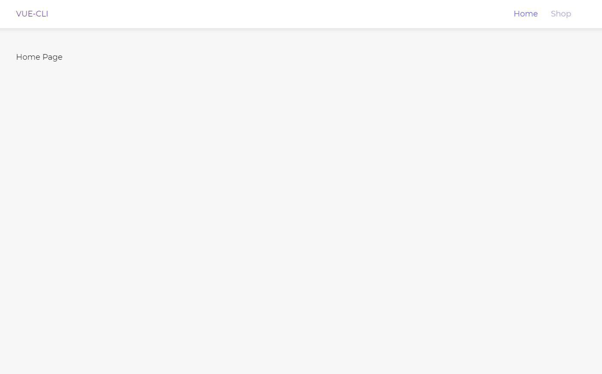
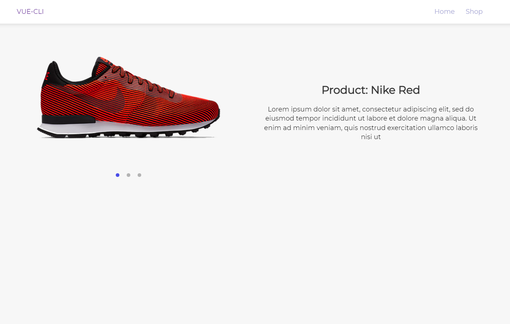

# vue-cli

## Project setup
```
npm install
```

### Compiles and hot-reloads for development
```
npm run serve
```

### Compiles and minifies for production
```
npm run build
```

### Lints and fixes files
```
npm run lint
```

### Vue Router
See [more info about Routers](https://router.vuejs.org/).

### VueX
See [more info about VuwX](https://vuex.vuejs.org/).



